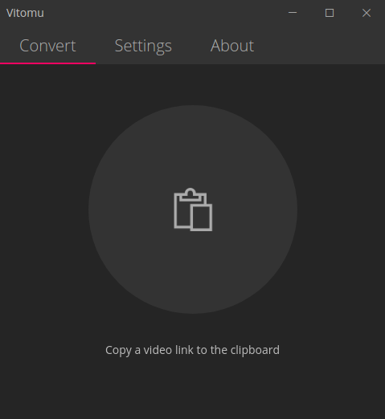

# Vitomu
Vitomu stands for **VI**deo **TO** **MU**sic converter. It allows easy conversion of online and offline videos to audio files. Just drop a URL or a local video file on the target to start the conversion. The current version supports dropping URL's of Youtube videos, and dropping of local MKV and MP4 files.

<a href='https://ko-fi.com/S6S11K63U' target='_blank'></a>

[](https://snapcraft.io/vitomu)

[](https://github.com/digimezzo/vitomu/releases/latest)
[](https://github.com/digimezzo/vitomu/issues)
[](https://www.paypal.com/cgi-bin/webscr?cmd=_s-xclick&hosted_button_id=MQALEWTEZ7HX8)

<a href='https://ko-fi.com/S6S11K63U' target='_blank'></a>

## Screenshot



## Important ##

This software uses code of <a href=http://ffmpeg.org>FFmpeg</a> licensed under the <a href=http://www.gnu.org/licenses/old-licenses/lgpl-2.1.html>LGPLv2.1</a> and its source can be downloaded <a href="https://github.com/FFmpeg/FFmpeg">here</a>

## Build prerequisites

- wine: required to build Windows package
- rpm: required to build rpm package
- libarchive-tools: contains bsdtar, which is required to build pacman package.

**To install the prerequisites on Ubuntu:**

sudo apt install wine rpm libarchive-tools

## Build instructions

```bash
$ git clone https://github.com/digimezzo/vitomu.git
$ cd vitomu
$ npm install            # Download dependencies
$ npm start              # Start Vitomu
$ npm run electron:windows   # Build for Windows
$ npm run electron:linux     # Build for Linux
$ npm run electron:mac       # Build for Mac

## Pacman installation notes

The pacman package contains a dependency to package libappindicator-sharp, which is no longer distributed with Arch Linux. I cannot remove this dependency for now, because it is an issue in electron-builder (the packaging tool which is used in this project). It is, however, possible to install Vitomu on Arch Linux or Manjaro using this command (replace x.y.z with the correct version number): 

`$ sudo pacman -U Vitomu-x.y.z.pacman --assume-installed libappindicator-sharp`